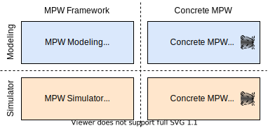

# MPW Modeling Framework

A framework to allow modeling of Mini Programming Worlds (MPWs).



The approach defines four sections:

* MPW Modeling Framework: represented by this repository, here the framework based on EMF is implemented
* Concrete MPW Modeling: based on the MPW Modeling, concrete MPWs can be modeled (see https://github.com/SQAHamster/mpw-modeling-hamster)
* MPW Simulator Framework: the generated meta-models are provided as a basic framework for the concrete simulators
    * The framework is placed under `/simulators` for the languages Java and C++
* Concrete MPW Simulator: this section relates to the final simulator, which can be executed (see under `/simulators` of https://github.com/SQAHamster/mpw-modeling-hamster)

## Motivation

The motivation of this project is to develop a polyglot hamster-simulation, which is based on a Model-Driven-Engineering approach to allow the support of multiple target languages like Java and C++.
Under https://git.rss.iste.uni-stuttgart.de/open-to-public/pse the PSE-Simulator can be found, which is a Java based simulator used for teaching in the course _Programmierung und Softwareentwicklung_ (PSE) at the University of Stuttgart.
While for Java this simulator is sufficient, there is also the requirement for teaching C++.
To provide a well-defined environment to teach C++ with the hamster-simulation, this project has the goal to provide a native C++ version, which is not based on wrappers.

Note: wrapping the JVM and provide a C-API works for many projects, but for teaching it brings complexity for setup and understanding the internals of the simulators.

## Concrete MPWs

### Hamster Simulator

MPW which is based on the [Boles](https://www.java-hamster-modell.de/simulator.html) and [PSE](https://git.rss.iste.uni-stuttgart.de/open-to-public/pse) hamster-simulator, to teach programming
based on controlling a hamster in a territory, to pick and put grains.

See: https://github.com/SQAHamster/mpw-modeling-hamster

### Kara the ladybug Simulator

MPW which is based on the "Kara the ladybug" game (https://www.swisseduc.ch/compscience/karatojava/kara/).
It allows to control a ladybug to collect leafs and move mushrooms in a mini world.

See: https://github.com/SQAHamster/mpw-modeling-kara

## Modeling Modules


**bundles** (contains Eclipse bundles)

*modeling.mpw*: defines the (meta-)meta-models for MPWs

*modeling.framework*: contains a MPW2 workflow to generate MPW Simulator Framework code

*modeling.transformation*: contains several QVTo transformations to transform concrete MPW input models into adjusted intermediary models used for code generation. Types of input models are meta-models (like the concrete Hamster meta-model), commands, queries or constraints.

*modeling.workflow*: contains the essence of the MWE2 modeling workflow in a reusable manner. It is used by other modules like *modeling.framework* to perform specific workflow runs.

*modeling.generator.cpp*: contains Xpand templates for generating C++ source code

*modeling.generator.java*: contains Xpand templates for generating Java source code

**features** (contains Eclipse features)

*feature*: defines the Eclipse feature for all required bundles to build the updatesite and deploy the MPW Modeling Framework

**releng** (contains release engineering artifacts)

*updatesite*: defines an updatesite which can be used for concrete MPW modeling environments to make use of the MPW Modeling Framework

*targetplatform*: defines a target platform for the Eclipse environment for all specific Eclipse plugin dependencies

## Wiki

Please visit the wiki (https://github.com/SQAHamster/mpw-modeling-framework/wiki) for further information regarding design, architecture or other topics.

## Java Version

The project is developed with JDK 15. Ensure that Eclipse has mapped a JavaSE-17.

Note: Eclipse can be started with a custom Java Runtime by specifying the `-vm` property in the `eclipse.ini` file

Example: 
```
-vm
<path-to-jdk>/bin
```

## Installed Eclipse Plugins

* Eclipse Modeling Tools - 2020-12
    * https://www.eclipse.org/downloads/packages/release/2020-12/r/eclipse-modeling-tools
* QVT Operational SDK - 3.10.2
    * Update site: https://download.eclipse.org/releases/latest
* OCL Examples and Editors SDK - 6.13.0
    * Update site: https://download.eclipse.org/releases/latest
* Xpand SDK	- 2.2.0
    * Update site: https://download.eclipse.org/releases/latest
* Xpand/Xtend Additional Support - 2.2.0
    * Update site: https://download.eclipse.org/modeling/m2t/xpand/updates/
* Xtext Complete SDK - 2.24.0
    * Update site: https://download.eclipse.org/releases/latest
    * if later downloading of ANTLR parser generator failed, also install `Xtext Antlr Runtime Feature` from http://download.itemis.com/updates/
* Henshin SDK (Incubation) - 1.6.0
    * Update site: http://download.eclipse.org/modeling/emft/henshin/updates/release
* C/C++ Development Tools - 10.1.0
    * Update site: https://download.eclipse.org/tools/cdt/releases/10.1/
* Query-DSL (QueryDSL Feature - 1.0.0)
    * Update site: https://raw.githubusercontent.com/SQAHamster/mpw-modeling-querydsl/1.0.0-updatesite/repository

### Optional: Setup Maven

* m2e: Maven integration in Eclipse - 1.17.1
    * Update site: https://download.eclipse.org/releases/latest
* Tycho Project Configurators - 0.8.1
    * under Preferences / Maven / Discovery / Open Catalog, search for the Tycho Configurators and install them 

## Setup

Note: after checkout there are many errors due to ungenerated files. They shall disappear after the following steps.
Simply click "Proceed" when a dialog occurs due to errors.

* run genmodels for "generate model code" or call Maven `generate-sources`
    * `de.unistuttgart.iste.sqa.mpw.modeling.mpw/model/mpw.genmodel`
    * `de.unistuttgart.iste.sqa.mpw.modeling.transformations/model/transformations.genmodel`
    * `de.unistuttgart.iste.sqa.mpw.modeling.transformations/model/inputs/inputs.genmodel`

* run transformation / generation workflow or call Maven `package`
    * `/de.unistuttgart.iste.sqa.mpw.modeling.framework/src-workflow/workflow/mpw_framework_workflow.mwe2`

* open target project in the IDE of choice
    * Java: by Maven: `de.unistuttgart.iste.sqa.mpw.framework.java`
    * C++: by CMake: `de.unistuttgart.iste.sqa.mpw.framework.cpp`

* run unit tests
    * Java: under `/core/src/test/java`
    * C++: use CTest after building

Note: Xpand / Xtend may still show some phantom errors in `de.unistuttgart.iste.sqa.mpw.generator.java/src/template` after successful generation. This errors can simply be ignored or removed by editing (e.g. inserting a dummy space character) the files marked with error and then save them.
      It seems that it is caused by "`Collection.flatten()`" usage in Xpand / Xtend. Currently I don't know why this errors occur and how to prevent them.
